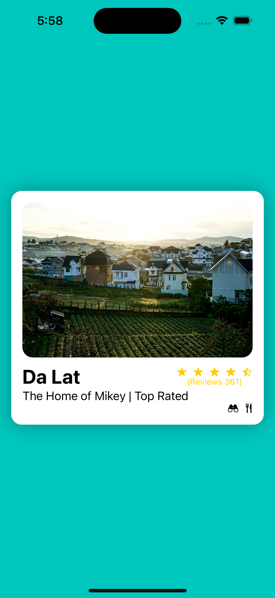

## Swift Coding Course - Lesson 2

    This repo contains the code I wrote while following along with lesson 2 of the Swift coding course by CodeWithChris on YouTube.

Course overview

    This course teaches the basics of building iOS apps using Swift and Xcode. Lesson 2 focuses on:

    Content Views

    HStack, ZStack, VStack
    
    Modifier Positioning
    
    SF Symbol Integration
    
About lesson 2

    In this lesson we build a simple travel tab with Swift, integrating SF Symbols.

To run the lesson 2 app code:

    Clone this repo
    Open the Xcode project file
    Build and run the app in a simulator or physical device

Let me know if you have any other questions!
